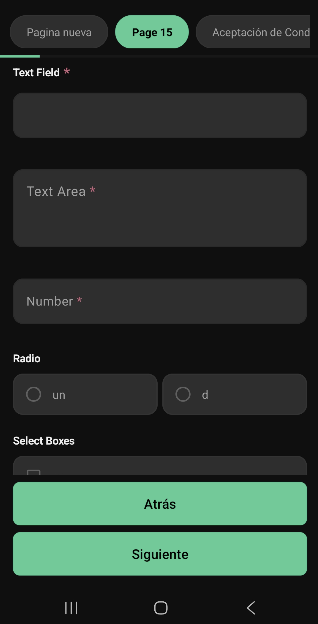
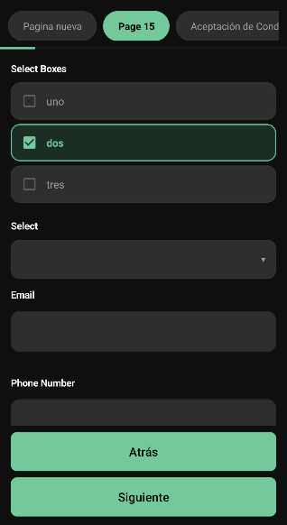
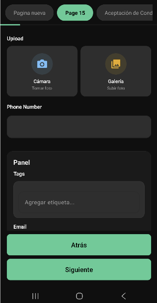
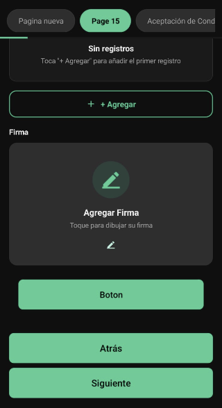

# formio-android

An Android library that renders [Form.io](https://form.io) JSON schemas as native mobile forms. Built with Kotlin, Material Design 3, and a dark-first UI.

> **Open source and community-driven.** Contributions, new components, and improvements are welcome!

---

## Screenshots

<table>
  <tr>
    <td align="center"><b>Basic fields</b></td>
    <td align="center"><b>Select &amp; checkboxes</b></td>
    <td align="center"><b>File upload &amp; panels</b></td>
    <td align="center"><b>Datagrid &amp; signature</b></td>
  </tr>
  <tr>
    <td></td>
    <td></td>
    <td></td>
    <td></td>
  </tr>
</table>

---

## Features

- ✅ Renders Form.io JSON schemas natively
- ✅ Multi-page wizard with tab navigation and progress bar
- ✅ **Loading overlay** — animated spinner shown while the form opens and during `app.ws()` HTTP calls
- ✅ **Async JSON parsing** — schema is parsed off the main thread so the UI never freezes
- ✅ **Lazy JS executor** — WebView for custom buttons is created on first tap, not at startup
- ✅ **Wizard validation** — required fields validated per page with error bottom sheet before advancing
- ✅ **HTML element with full CSS** — `htmlelement` components with inline `style=` are rendered in a WebView so all styling is respected
- ✅ Conditional logic (`conditional`, `customConditional`, JSON Logic)
- ✅ `calculateValue` expressions with live re-evaluation
- ✅ Field validation (required, minLength, maxLength, pattern, min/max, custom JS)
- ✅ Button themes: `primary`, `success`, `warning`, `info`, `danger`, `secondary`
- ✅ Button with custom JS execution (`app.ws()`, `form.getComponent()`, `moment()`)
- ✅ Camera and gallery photo capture
- ✅ Signature pad with zoom preview
- ✅ Map / location picker
- ✅ Datagrid and EditGrid (repeating rows)
- ✅ Panel, Columns, Tabs, Table layout components
- ✅ `refreshOn` / `clearOnRefresh` cascading selects
- ✅ Dark theme with fully overridable Material 3 color tokens
- ✅ Returns form data as `Map<String, Any?>` — you control persistence

---

## Supported components

| Form.io type | Status |
|---|---|
| `textfield`, `email`, `phoneNumber` | ✅ |
| `textarea` | ✅ |
| `number`, `currency` | ✅ |
| `select` (static, URL, custom) | ✅ |
| `radio` | ✅ |
| `checkbox` | ✅ |
| `selectboxes` | ✅ |
| `tags` | ✅ |
| `datetime`, `day` | ✅ |
| `file` (camera + gallery) | ✅ |
| `signature` | ✅ |
| `map` / `location` | ✅ |
| `address` | ✅ |
| `survey` | ✅ |
| `htmlelement` (with inline CSS) | ✅ |
| `button` (all themes + custom JS) | ✅ |
| `panel`, `well` | ✅ |
| `columns` | ✅ |
| `table` | ✅ |
| `tabs` | ✅ |
| `datagrid`, `editgrid` | ✅ |
| `datamap` | ✅ |
| `hidden` | ✅ |

---

## Installation

### Step 1 — Add JitPack to your project

```kotlin
// settings.gradle.kts
dependencyResolutionManagement {
    repositories {
        google()
        mavenCentral()
        maven { url = uri("https://jitpack.io") }
    }
}
```

```groovy
// settings.gradle (Groovy)
dependencyResolutionManagement {
    repositories {
        google()
        mavenCentral()
        maven { url 'https://jitpack.io' }
    }
}
```

### Step 2 — Add the dependency

```kotlin
// build.gradle.kts
dependencies {
    implementation("com.github.gjagomez:formio-android:1.1.0")
}
```

```groovy
// build.gradle (Groovy)
dependencies {
    implementation 'com.github.gjagomez:formio-android:1.1.0'
}
```

---

## Usage

### Launch a form

```kotlin
// 1. Register the launcher in your Activity or Fragment
val formLauncher = registerForActivityResult(FormioRenderer.Contract()) { result ->
    result ?: return@registerForActivityResult

    val formData: Map<String, Any?> = result.formData
    val isFinal: Boolean = result.isFinal  // false = draft save, true = completed

    // Persist the data however your app needs
}

// 2. Launch with a Form.io schema JSON string
formLauncher.launch(
    FormioRenderer.Input(
        schemaJson  = mySchema,          // String — the Form.io JSON schema
        prefillData = emptyMap(),        // Optional: pre-populate fields
        title       = "My Form"          // Displayed in the toolbar
    )
)
```

### Edit an existing submission

```kotlin
val prefill: Map<String, Any?> = mapOf(
    "firstName" to "Juan",
    "dpi"       to "1234567890101"
)

formLauncher.launch(
    FormioRenderer.Input(
        schemaJson  = mySchema,
        prefillData = prefill,
        title       = "Edit submission"
    )
)
```

### Remote selects (`dataSrc: "url"`)

Selects can load their options from any JSON endpoint configured in the Form.io designer — no app code needed:

```json
{
    "type": "select",
    "label": "Model",
    "key": "model",
    "dataSrc": "url",
    "data": {
        "url": "https://api.example.com/models?make={{ data.make }}"
    },
    "selectValues": "Results",
    "valueProperty": "Model_Name",
    "template": "<span>{{ item.Model_Name }}</span>",
    "lazyLoad": true
}
```

| Property | Description |
|---|---|
| `data.url` | GET endpoint. Supports `{{ data.otherField }}` placeholders resolved from current form values |
| `data.headers` | Optional request headers `[{ "key": "...", "value": "..." }]` |
| `selectValues` | Dot-path to the array inside the response (e.g. `"Results"`, `"data.items"`). Omit if response is already an array |
| `valueProperty` | Dot-path to the stored value inside each item |
| `template` | Item label, e.g. `"<span>{{ item.name }}</span>"` (HTML is stripped) |
| `lazyLoad` | `true` = fetch on first tap, `false` = fetch when the field renders |

Cascading selects work out of the box: combine `refreshOn: "make"` + `clearOnRefresh: true` — when `make` changes, the dependent select clears and reloads automatically.

### Custom button actions (`app.ws()`)

Buttons with a `custom` JS field can call a backend endpoint and update form fields. While the call is in flight, a full-screen loading overlay is shown automatically:

```json
{
    "type": "button",
    "label": "Consultar",
    "key": "btnConsultar",
    "theme": "primary",
    "action": "custom",
    "custom": "app.ws({ url: 'https://api.example.com/lookup', data: { dpi: data.dpi } }, 'post').then(function(res) { form.getComponent('nombre').setValue(res.nombre); });"
}
```

Supported JS APIs inside `custom`:

| API | Description |
|---|---|
| `app.ws(settings, method)` | HTTP call — shows loading overlay, returns a Promise |
| `form.getComponent(key).setValue(val)` | Set a field value from the response |
| `form.getComponent(key).getValue()` | Read a field value |
| `app.mostrarMensaje(title, msg, type)` | Show a toast (`info`, `success`, `warning`, `danger`) |
| `moment(date, format)` | Basic date formatting |

### Result explained

| Field | Type | Description |
|---|---|---|
| `formData` | `Map<String, Any?>` | All field values keyed by the Form.io component `key` |
| `isFinal` | `Boolean` | `true` when the user completed the last page, `false` on draft save |

---

## Theming

The library ships with a dark Material 3 theme. Every color is overridable in your app's `res/values/colors.xml`:

```xml
<!-- res/values/colors.xml in your app -->
<resources>
    <!-- Brand accent (buttons, borders, active states) -->
    <color name="accent_green">#00C896</color>

    <!-- Backgrounds -->
    <color name="bg_primary">#0F0F0F</color>
    <color name="bg_card">#1A1A1A</color>
    <color name="bg_input">#242424</color>

    <!-- Text -->
    <color name="text_primary">#F0F0F0</color>
    <color name="text_secondary">#A0A0A0</color>

    <!-- Validation -->
    <color name="error_color">#CF6679</color>

    <!-- Button themes -->
    <color name="btn_primary_bg">#00C896</color>
    <color name="btn_primary_text">#000000</color>
    <color name="btn_success_bg">#4CAF50</color>
    <color name="btn_warning_bg">#FFB74D</color>
    <color name="btn_info_bg">#4FC3F7</color>
    <color name="btn_danger_bg">#CF6679</color>
</resources>
```

---

## Permissions

The library declares the following permissions in its `AndroidManifest.xml`. They are merged automatically into your app via manifest merge — no manual changes needed.

| Permission | Required for |
|---|---|
| `INTERNET` | Remote selects, `app.ws()` HTTP calls, WebView HTML |
| `CAMERA` | `file` component — take a photo |
| `READ_EXTERNAL_STORAGE` (≤ API 32) | `file` component — pick from gallery |
| `READ_MEDIA_IMAGES` (API 33+) | `file` component — pick from gallery |
| `ACCESS_FINE_LOCATION` | `map` / `location` component |
| `ACCESS_COARSE_LOCATION` | `map` / `location` component (fallback) |

If your form does not use file upload or location fields, Google Play will still see these permissions declared. You can remove them in your app's manifest with:

```xml
<uses-permission android:name="android.permission.CAMERA"
    tools:node="remove" />
<uses-permission android:name="android.permission.ACCESS_FINE_LOCATION"
    tools:node="remove" />
```

---

## Try the sample app

A complete working example is in the [`sample/`](sample/) folder.

**To run it:**

```bash
git clone https://github.com/gjagomez/formio-android.git
cd formio-android/sample
./gradlew installDebug
```

> Open the `sample/` folder (not the repo root) in Android Studio.

---

## Requirements

| | |
|---|---|
| Min SDK | 29 (Android 10) |
| Target SDK | 34 (Android 14) |
| Language | Kotlin |
| UI toolkit | Material Design 3 |

---

## Changelog

### v1.1.0
- Loading overlay shown while the form opens and during HTTP button calls
- Async JSON schema parsing — no more UI freeze on large forms
- Lazy WebView — faster navigation between wizard pages
- Wizard validation fixed — required fields validated reliably on every page
- `htmlelement` with inline CSS now rendered via WebView (full style support)
- Added `survey`, `address`, `checkbox`, `editgrid`, `table`, `datamap`, `day` components
- Button themes: `primary`, `success`, `warning`, `info`, `danger`, `secondary`

### v1.0.0
- Initial release

---

## Roadmap

- [ ] Light theme support
- [ ] `signature` — upload from gallery
- [ ] `file` — multiple file upload
- [ ] Accessibility (TalkBack support)
- [ ] English / i18n string overrides
- [ ] Offline-first data queue (bring-your-own persistence)

---

## Contributing

Contributions are very welcome!

1. Fork the repository
2. Create a feature branch: `git checkout -b feat/my-new-component`
3. Commit your changes: `git commit -m "feat: add survey component"`
4. Push to the branch: `git push origin feat/my-new-component`
5. Open a Pull Request

Please open a GitHub Issue before starting large changes so we can align on the approach.

---

## License

```
MIT License

Copyright (c) 2024 gjagomez

Permission is hereby granted, free of charge, to any person obtaining a copy
of this software and associated documentation files (the "Software"), to deal
in the Software without restriction, including without limitation the rights
to use, copy, modify, merge, publish, distribute, sublicense, and/or sell
copies of the Software, and to permit persons to whom the Software is
furnished to do so, subject to the following conditions:

The above copyright notice and this permission notice shall be included in all
copies or substantial portions of the Software.

THE SOFTWARE IS PROVIDED "AS IS", WITHOUT WARRANTY OF ANY KIND, EXPRESS OR
IMPLIED, INCLUDING BUT NOT LIMITED TO THE WARRANTIES OF MERCHANTABILITY,
FITNESS FOR A PARTICULAR PURPOSE AND NONINFRINGEMENT. IN NO EVENT SHALL THE
AUTHORS OR COPYRIGHT HOLDERS BE LIABLE FOR ANY CLAIM, DAMAGES OR OTHER
LIABILITY, WHETHER IN AN ACTION OF CONTRACT, TORT OR OTHERWISE, ARISING FROM,
OUT OF OR IN CONNECTION WITH THE SOFTWARE OR THE USE OR OTHER DEALINGS IN THE
SOFTWARE.
```
